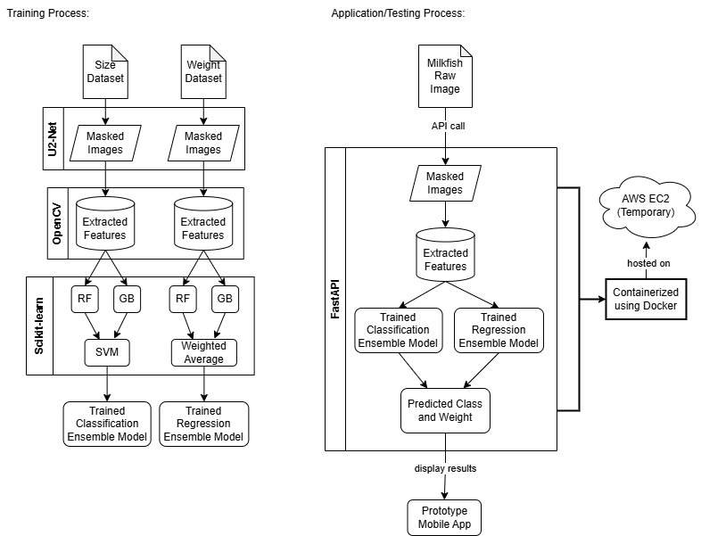

# Milkfish Size Classification and Weight Estimation

---

## Objective
Analyze individual milkfish in images to classify size categories and estimate weight using morphometric features and ensemble learning.

---

## Installation
Install runtime dependencies listed in `requirements.txt` (recommended). Example:

```bash
pip install -r requirements.txt
```

Docker is also supported; see the `Dockerfile` for the containerized runtime. Alternatively, you can pull the pre-built Docker image directly from Docker Hub:

```bash
docker pull mae13/ml-api
```

---

## Architecture


The diagram above illustrates the overall architecture of the milkfish classification and regression system, including data pipeline, feature extraction, segmentation, model training, and API deployment.

---

## Dataset Preparation
- Format: Pre-labeled YOLO-style dataset with image files and corresponding `.txt` annotations.
- Annotations are parsed and converted into a feature table containing bounding-box and per-object identifiers.

---

## Feature Extraction (implemented)
- Utilities in `utils/extractor_utils.py` extract morphometric features from segmented masks, including length, width, area, perimeter, aspect ratio, solidity, circularity, and convex hull area.
- Features are merged and normalized into CSV data files under `outputs/data/`.

---

## Features Used
- Morphometric features (extracted from binary masks):
	- Length
	- Width
	- Area
	- Perimeter
	- Aspect Ratio
	- Solidity
	- Circularity
	- Convex Hull Area
	- Equivalent Diameter
	- Feret Diameter
- Derived / normalized features:
	- Normalized versions of the above and engineered ratios (used for model inputs)
- Ensemble inputs:
	- Classifier probability vectors from Gradient Boosting and Random Forest (used as features for SVM stacking and for soft-voting ensembles)

---

## Results Summary
- Classification:
	- Accuracy: 95% (reported on the evaluation split)
	- Additional evaluation artifacts: precision, recall, F1-score and confusion matrix are produced during evaluation and saved with model outputs
- Regression (weight estimation):
	- RMSE ≈ 140 g on the validation/test split
	- MAE and R² are also recorded during evaluation (see outputs)
- Artifacts and logs: trained models, evaluation CSVs, and feature tables are saved under `outputs/models/` and `outputs/data/`.

---

## Segmentation and Mask Outputs
- Segmentation in this project is performed with the U²-Net model (see the `segmented_image` module).
- Resulting binary masks are saved under `outputs/masks/` and used for morphometric feature extraction.

---

## Models and Training
- Classification: Gradient Boosting and Random Forest classifiers are implemented; training scripts are in `models/gradient_boosting` and `models/random_forest`.
- Ensembles: an SVM-based stacking ensemble and a soft voting ensemble are implemented to combine classifier outputs.
- Regression: ensemble regression (weighted averaging) combines regressor predictions for final weight estimates.

---

## API and Deployment
- A FastAPI app exposes prediction endpoints for size classification and weight estimation.
- The service is containerized with Docker and deployed on an AWS EC2 instance.
- Live API address: http://3.24.218.129:8000/
- Note: This is only a temporary cloud infrastructure choice solely for demo purposes. This is subject to change due to cost reasons.

---

## Project Structure (high level)
```
README.md
app.py           # API entrypoint
classify.py      # classification inference / orchestration
regress.py       # regression inference / orchestration
models/          # training and model artifacts
outputs/         # CSVs, masks, saved models
segmented_image/ # U²-Net segmentation utilities
utils/           # feature extraction and image utilities
```
